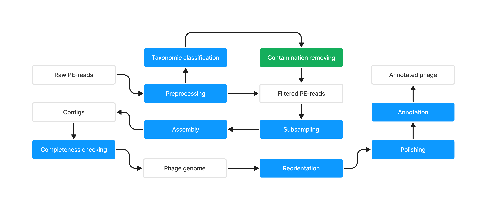

This repository contains code for the reproducible assembly of phage genomes from
Illumina/DNBSEQ PE-reads

### Dependencies
- [Anaconda](https://www.anaconda.com/)
- [Snakemake](https://snakemake.readthedocs.io)
- [fastp](https://github.com/OpenGene/fastp)
- [Kraken2](https://github.com/DerrickWood/kraken2)
- [KrakenTools](https://github.com/jenniferlu717/KrakenTools)
- [SPAdes](https://github.com/ablab/spades)
- [CheckV](https://bitbucket.org/berkeleylab/checkv)
- [Bowtie2](https://github.com/BenLangmead/bowtie2)
- [SAMtools](https://www.htslib.org/)
- [Pilon](https://github.com/broadinstitute/pilon)
- [Pharokka](https://github.com/gbouras13/pharokka)

### Running pipeline

### Output structure

